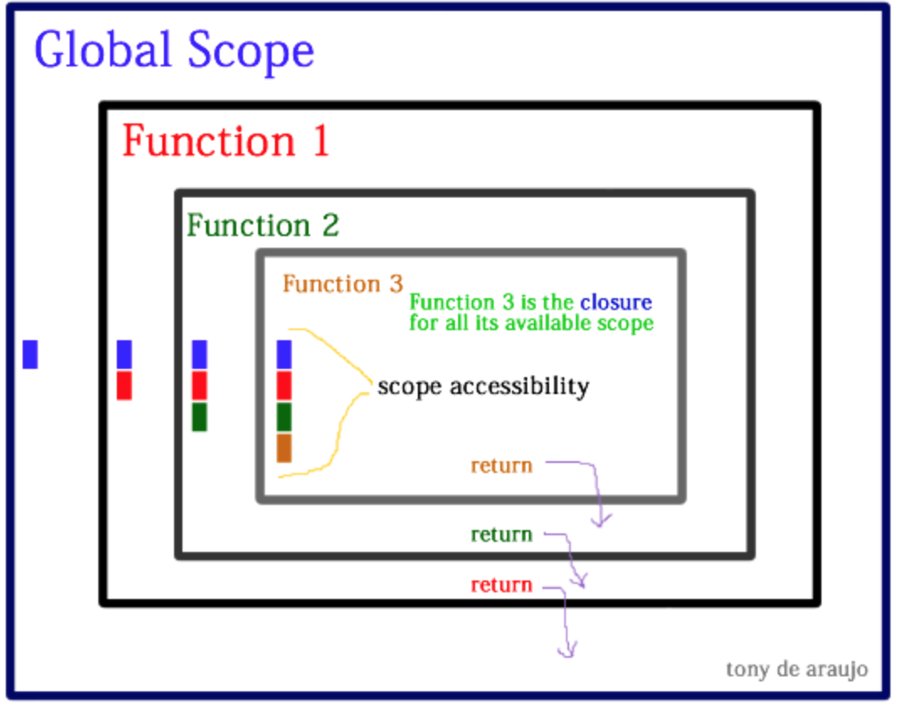

# W1.D5

### Topic: Javascript

Section Jump

<!-- [Functions](##Functions) || [Function Parameter and scope](##Function Parameter and scope)  || [JS Objects](##Objects) || [##Function Hoisting]() || [IIFE and Annoymous Functions](##IIFE and Annoymous Functions)
-->
# Learning Competencies

- Introducing Functions/Methods in Javascript, Parametrized functions and understanding function scope
- Objects in Javascript with understanding of interation & properties
- What is function Hoisting & how does it effect function declaration & 
- An Introduction to IIFEs
- Annoymous functions

## Functions

### What Wikipedia says
Generally speaking, a function is a "subprogram" that can be called by code external (or internal in the case of recursion) to the function. Like the program itself, a function is composed of a sequence of statements called the function body. Values can be passed to a function, and the function will return a value.

As such, a function may have properties and methods, such as .call() and .bind(). A nested function is a function defined within another function. It is created each time the outer function is invoked. In addition, each nested function forms a lexical closure: The lexical scope of the outer function (including any constant, local variable, or argument value) becomes part of the internal state of each inner function object, even after execution of the outer function concludes.


### Why to use Function
The need of using a function can be explained by 2 reasons:
1. The first reason is reusability. Once a function is defined, it can be used over and over and over again. You can invoke the same function many times in your program, which saves you work. Imagine what programming would be like if you had to teach the computer about sines every time you needed to find the sine of an angle! You'd never get your program finished!

Another aspect of reusability is that a single function can be used in several different (and separate) programs. When you need to write a new program, you can go back to your old programs, find the functions you need, and reuse those functions in your new program. You can also reuse functions that somebody else has written for you, such as the sine and cosine functions.

2. The second reason is abstraction. In order to use a particular function you need to know the following things:
    - The name of the function;
    - What the function does;
    - What arguments you must give to the function; and
    - What kind of result the function returns.

### Understanding Function Syntax

**Declaration of Functions**

In general, we declare a function in the following way:
```js
function anyNameYouWantForTheFunction() {
    // As many lines of code as you want
}
```
In general, this type of function syntax consists of four parts:

- The `function` keyword,
- The name of the function (in this case, anyNameYouWantForTheFunction),
- Any parameters for the function (we'll ignore this for now, but parameters will go inside of the parentheses after the function name),
- The function body (the code for the function, which lives inside of the curly braces).

**Returning Values From Functions**
In JavaScript, if we do not specifically tell the function to return something, it will return undefined when it is finished executing
```js
// this is called the function definition -
// we are ONLY defining the function here
function firstFunction(){
    return "I just wrote my first function!";
}

// to call or invoke the function
firstFunction(); // now we don't see undefined anymore!
```

## Function Parameter and scope

### What wikipedia says
A **parameter** is a special kind of variable, used in a subroutine to refer to one of the pieces of data provided as input to the subroutine. These pieces of data are called arguments. An ordered list of parameters is usually included in the definition of a subroutine, so that, each time the subroutine is called, its arguments for that call can be assigned to the corresponding parameters.

The idea of **scope** is that it’s where certain functions or variables are accessible from in our code, & the context in which they exist & are executed in. Scope is function-based and pertains to the variable access of a function when it is invoked and is unique to each invocation.

### Why to use Parameter and Scope
The primary use of **parameters** is to return multiple values from a function, while the use of input/output parameters is to modify state using parameter passing (rather than by shared environment, as in global variables). An important use of returning multiple values is to solve the semipredicate problem of returning both a value and an error status.

**Scope** is an important component of name resolution, which is in turn fundamental to language semantics. Name resolution (including scope) varies between programming languages, and within a programming language, varies by type of entity; the rules for scope are called scope rules or scoping rules. Together with namespaces, scoping rules are crucial in modular programming, so a change in one part of the program does not break an unrelated part.

### Fox example.
Let's write a function called add that takes in two parameters - number1 and number2 - and returns their sum.

```js
function add(number1, number2){
    return number1 + number2;
}
```
Now our add function will work for any two numbers that we want to add together. It's important to note that the name of the parameters, number1 and number2, are arbitrary names that we have chosen. If we change the names of the parameters to a and b, the function would do exactly the same thing:
```js
// This function will do the same thing as our previous function
function add(a, b){
    return a + b;
}
```
Let's see how we invoke that function:
```js
add(4, 6); // returns 10
add(2, 8); // returns 10
add(7, 1); // returns 8
```
In the example above, we are now invoking the add function with parameters. A parameter can be a literal number like we have above, or we could even use variables:
```
var num1 = 5;
var num2 = 8;
add(num1, num2);  // returns 13
```
It is important to understand that the variable names we are using when we invoke the function are not related at all to the variable names we have defined inside of the function. The values of num1 and num2 are being copied into the parameters number1 and number2 that are defined in the function.

**SCOPE**
The context in which values and expressions are 'visible,' or can be referenced. there are only 2 kinds of scope: global scope and function scope. The important takeaways here are:

1. All variables that are defined outside of functions (and inside of functions without the var keyword) are declared in the global scope, and

2. All variables defined inside of functions can only be accessed by those functions (and any inner functions).



Let's see an example:
```js
var globalVariable = "I live in the global scope";

function makeNewScope(){
    var functionScopeVariable = "I live in the scope of the makeNewScope function";
}

globalVariable; // "I live in the global scope";
makeNewScope(); // maybe this will define the functionScopeVariable...

functionScopeVariable; // This gives us an error! To be specific, a ReferenceError because the functionScopeVariable is not defined.
```
```js
// Since this variable declaration is in the global scope, it will
// be a global variable with or without the var keyword.  It is a best
// practice to always use the var keyword though.
globalVariable = "I live in the global scope";

function makeNewScope(){
    // You do not want to do this in practice.  You should
    // always defined your variables with the var keyword.
    functionScopeVariable = "What happens now?";
}

globalVariable; // "I live in the global scope"
makeNewScope(); // now this will define the functionScopeVariable!

// The value of the variable will be "What happens now?"
functionScopeVariable;
```
If we omit the var keyword inside of a function, we actually declare that variable in the global scope.
Read more about Scope [here](https://scotch.io/tutorials/understanding-scope-in-javascript)


## Objects

### What Wikipedia says
For convenience, types are normally subdivided into primitives and objects. Objects are entities that have an identity (they are only equal to themselves) and that map property names to values ("slots" in prototype-based programming terminology). Objects may be thought of as associative arrays or hashes, and are often implemented using these data structures. However, objects have additional features, such as a prototype chain which ordinary associative arrays do not have.

### Why to use objects
Object Oriented Programming (OOP) refers to using self-contained pieces of code to develop applications. We call these self-contained pieces of code **objects**, better known as Classes in most OOP programming languages and Functions in JavaScript. We use objects as building blocks for our applications. Building applications with **objects** allows us to adopt some valuable techniques, namely, **Inheritance** (objects can inherit features from other objects), **Polymorphism** (objects can share the same interface—how they are accessed and used—while their underlying implementation of the interface may differ), and **Encapsulatio**n (each object is responsible for specific tasks).

### 
JavaScript has several kinds of built-in objects, namely Array, Boolean, Date, Function, Math, Number, Object, RegExp and String. Other objects are "host objects", defined not by the language, but by the runtime environment. For example, in a browser, typical host objects belong to the DOM (window, form, links, etc.).

Objects are composed of attributes. If an attribute contains a function, it is considered to be a method of the object, otherwise the attribute is considered a property.

### Object Properties
Object properties can be any of the three primitive data types, or any of the abstract data types, such as another object. Object properties are usually variables that are used internally in the object's methods, but can also be globally visible variables that are used throughout the page.

The syntax for adding a property to an object is −
`
objectName.objectProperty = propertyValue;
`
For example − The following code gets the document title using the "title" property of the document object.
```js
var str = document.title;
```
### Object Methods
Methods are the functions that let the object do something or let something be done to it. There is a small difference between a function and a method – at a function is a standalone unit of statements and a method is attached to an object and can be referenced by the this keyword.

Methods are useful for everything from displaying the contents of the object to the screen to performing complex mathematical operations on a group of local properties and parameters.

For example − Following is a simple example to show how to use the write() method of document object to write any content on the document.
```js
document.write("This is test");
```

The basic example of object is given below:
```js
var firstObj = {
    firstName: "Tim",
    lastName: "Garcia",
    isInstructor: true
};
```

In this object, we have keys of `firstName`, `lastName`, and `isInstructor` and values of `Tim`, `Garcia`, and `true` respectively.  It has a key, followed by a colon, followed by a value, then a comma

Read more about creating Objects [here](https://docs.microsoft.com/en-us/scripting/javascript/creating-objects-javascript)


### Accessing Object Values
To access values in an object, we could use the dot notation:
```js
firstObj.firstName;       // returns "Tim"
firstObj.lastName;        // returns "Garcia"
firstObj.isInstructor;    // returns true
firstObj.keyDoesntExist;  // returns undefined
```
Or we could use the bracket notation:
```js
firstObj["firstName"];       // returns "Tim"
firstObj["lastName"];        // returns "Garcia"
firstObj["isInstructor"];    // returns true
firstObj["keyDoesntExist"];  // returns undefined
```
**Keys Are Always Strings in JavaScript**

Create the following object of some employee id to the employee name:
```js
var idToName = {
    754: "Tim",
    843: "Matt",
    921: "Janey",
    192: "Elie"
};
```
Now we want to access the key 754 to get the value "Tim". We cannot use the dot notation for this:
```js
idToName.754;  // causes an error
```
Instead we need to use the bracket notation. And the value inside the bracket notation is a string:
```js
idToName["754"];  // returns "Tim"
```
So even though we did not quote the key name when we created the idToName object, JavaScript automatically converts the number into a string. Every key in a JavaScript object is a string!

### Adding Key to objects
```js
var obj = {
    name: "Jon Snow",
    watchMember: true
};

obj.gameOfThrones = "awesome";
obj;
/*
{
    name: "Jon Snow",
    watchMember: true,
    gameOfThrones: "awesome"
}
*/
```
### Removing Key from objects
```js
var obj = {
    name: "Elie",
    job: "Instructor"
};

delete obj.job; // returns true

obj;
/*
{
    name: "Elie"
}
*/
```
There are different javascript pre-built objects about which you can read below:
- https://developer.mozilla.org/en/docs/Web/JavaScript/Reference/Global_Objects

### Iteration of Objects
Looping over objects
print out all of the values in an object. 
```js
var obj = {
    firstName: "Elie",
    lastName: "Schoppik",
    favoriteColor: "purple",
    job: "instructor",
    isDeveloper: true
};

console.log(obj.firstName);
console.log(obj.lastName);
console.log(obj.favoriteColor);
console.log(obj.job);
console.log(obj.developer);
```
There are cases where we don't know the keys that an object has. In that case, looping is a much better idea. Let's take a look at how we would loop over the keys in an object.

To iterate over objects, we use a for in loop.
```js
var instructor = {
    name: "Matt",
    mathWizard: true,
    dogOwner: true
};

for(var singleKey in instructor){
    console.log(instructor[singleKey]);
}

// the loop will log:
// "Matt"
// true
// true
```
In the code example, singleKey is a variable that will be assigned to each key in the instructor object. To access the key's value, we must use the bracket notation.

**if...in: Determining If a Key Exists in an Object**

Sometimes, we just want to check and see if a certain key exists in an object. To do that we use a if...in statement. Here is an example
```js
var obj = {
    favoriteNumber: 33,
    favoriteColor: 'blue'
}

if ("favoriteNumber" in obj){
    console.log("The favoriteNumber key exists!");
}

// "The favoriteNumber key exists!"

if ("nothing" in obj){
    console.log("The nothing key exists!");
}
```

## Function Hoisting

### What Wikipedia Says
Because variable declarations (and declarations in general) are processed before any code is executed, declaring a variable anywhere in the code is equivalent to declaring it at the top. This also means that a variable can appear to be used before it's declared. This behavior is called "hoisting", as it appears that the variable declaration is moved to the top of the function or global code.

The same idea applies in functions. When a variable is created in a function using the var keyword, the variable is actually defined at the top of its scope. In the following example, displayInstructor function creates a new scope and var instructor is a variable defined within that scope. Therefore, javascript creates the variable in memory at the top of the function. That means the instructor will be undefined when it is returned.
```js
function displayInstructor(){
    return instructor;
    var instructor = "Elie";
}
```

### Why Hoisting use
Hoisting gathers all your function definitions and moves them to the top of their scope - the main program or the function that they are declared in. If this seems obvious to you then you have grown accustomed, perhaps too accustomed, to the benefits of hoisting. As will become apparent hoisting of functions doesn't work if the program if changed in away that seems insignificant. Without a proper understanding of hoisting, your programs are susceptible to subtle bugs. To help avoid these bugs, many developers (and linting tools) advocate for a single variable declaration statement at the very beginning of every scope.

### Examples 

### Hoisting In Function Declarations vs Function Expressions

Function declarations are fully defined before the code is run. So in the following example, we can call the sayHi function above the lines that define the sayHi function:
```js
sayHi("Matt"); // "Hello Matt"

function sayHi(name){
    return "Hello " + name;
}
```
However, function expressions act differently. Since a function expression assigns an anonymous function to a variable, hoisting applies to that variable name as well. In the following example, there is an error because we are trying to invoke a function called sayHi but at that point in the code sayHi is not equal to a function. In fact, sayHi exists in memory but it is undefined.
```js
sayHi("Matt"); // Throws an error!
```
```js
var sayHi = function(name){
    return "Hello " + name;
}
```
The above example is equivalent to the following code. First the sayHi variable gets created at the top and is set to undefined. Then we try to invoke a function using the sayHi variable but since it is undefined, we get an erorr. To fix the issue, we would have to move the function expression above the invocation.
```js
var sayHi;
sayHi("Matt"); // Throws an error because undefined is not a function (we are using the type of undefined and trying to invoke it - that's why we get a TypeError)

sayHi = function(name){
    return "Hello " + name;
}
```


## IIFE and Annoymous Functions

### What Wikipedia says
An immediately-invoked function expression (or IIFE, pronounced "iffy") is a JavaScript programming language idiom which produces a lexical scope using JavaScript's function scoping. Immediately-invoked function expressions can be used to avoid variable hoisting from within blocks, protect against polluting the global environment and simultaneously allow public access to methods while retaining privacy for variables defined within the function. This concept has been referred to as a self-executing anonymous function,but Ben Alman introduced the term IIFE as a more semantically accurate term for the idiom, shortly after its discussion arose on comp.lang.javascript.

### Why IIFE used
1. To Avoid Polluting the Global Scope
The most popular use of the IIFE is to avoid declaring variables in the global scope. Many JavaScript libraries use this technique, and of course many JS pros, too. It is especially popular amongst jQuery plugin developers. And you should use an IIFE in the top-level (main.js) of your applications.

2. Use With the Conditional Operator
IIFE is used with the conditonal statment but it quite powerful since you can execute complex logic without having to setup.
While using with Conditional operator, function should have to be anonymous for creating IIFE
**Anonymous Function**
The first is a function declaration:
```js
function declaredFunction(){
    return "I am a function declaration!";
}
```
The second is a function expression:
```js
var expression = function(){
    return "I am a function expression!";
};
```
One difference between two is that when we use a function expression, we do not assign a "name" to the function. A function's name is the string of characters that come in between the function keyword and the set of parentheses (). The first function has a name, declaredFunction, but the second function, a function expression, does not have a name. The function without a name is called an **anonymous function.**

3. To fix this side effect (bug) in closures, you can use an Immediately Invoked Function Expression (IIFE), such as the following:
```js
function celebrityIDCreator (theCelebrities) {
    var i;
    var uniqueID = 100;
    for (i = 0; i < theCelebrities.length; i++) {
        theCelebrities[i]["id"] = function (j)  { // the j parametric variable is the i passed in on invocation of this IIFE​
            return function () {
                return uniqueID + j; // each iteration of the for loop passes the current value of i into this IIFE and it saves the correct value to the array
            } () // BY adding () at the end of this function, we are executing it immediately and returning just the value of uniqueID + j, instead of returning a function.
        } (i); // immediately invoke the function passing the i variable as a parameter​
    }

    return theCelebrities;
}

var actionCelebs = [{name:"Stallone", id:0}, {name:"Cruise", id:0}, {name:"Willis", id:0}];

var createIdForActionCelebs = celebrityIDCreator (actionCelebs);

var stalloneID = createIdForActionCelebs [0];
console.log(stalloneID.id); // 100​

var cruiseID = createIdForActionCelebs [1];
console.log(cruiseID.id); // 101
```

## For example

To create an IIFE, simply wrap your anonymous function in parentheses, and then call the function:
```js
(function(){
    var person = "Elie";
    return person;
})();
```
The example defines an anonymous function that is immediately invoked. Therefore, the function executes and returns "Elie". We can even save the result of the immediately invoked function expression:
```js
var result = (function(){
    var person = "Elie";
    return person;
})();

console.log(result);
```
(Note: the parenthesis around the function declaration are not optional! If you don't include them, you'll get a SyntaxError. You should verify this for yourself.)

### IIFEs That Return Objects
One common use case for immediately invoked function expressions is to return an object. For example, you may have an object that has information about a person:
```js
var personObject = (function() {
    return {
        name: "Tim",
        age: 32,
        occupation: "developer",
        hobbies: "sailing"
    };
})();
```
After the code is executed, the personObject is equal to the object that was returned from the anonymous function. We can now use the object:
```js
personObject.name; // returns "Tim"
personObject.age; // returns 32
personObject.occupation; // returns "developer"
personObject.hobbies; // returns "sailing"
```

# Exploration

## - Functions Basics

- [Mozilla Developer Network Functions Docs](https://developer.mozilla.org/en-US/docs/Web/JavaScript/Reference/Functions)
- [Easy to Read Guide on Functions by Digital Oceans](https://www.digitalocean.com/community/tutorials/how-to-define-functions-in-javascript)

## - Function Parameter and scope

- [Understanding Scope and Context in JavaScript by Ryan Morr](http://ryanmorr.com/understanding-scope-and-context-in-javascript/)
- [JS Playground: Scope and this in JavaScript](https://javascriptplayground.com/javascript-variable-scope-this/)
- [Scope Cheatsheet by MDN](https://developer.mozilla.org/en-US/docs/Archive/Web/Scope_Cheatsheet)
- [Function Scope by MDN](https://developer.mozilla.org/en-US/docs/Web/JavaScript/Guide/Functions#Function_scope)
- [Default Parameters by MDN](https://developer.mozilla.org/en-US/docs/Web/JavaScript/Guide/Functions#Function_parameters)
- [Speaking JS tutorials on Functions](http://speakingjs.com/es5/ch15.html)

# - Objects

- [Introducing JavaScript objects]()
- [Object](https://developer.mozilla.org/en-US/docs/Web/JavaScript/Reference/Global_Objects/Object)
- [JavaScript object basics](https://developer.mozilla.org/en-US/docs/Learn/JavaScript/Objects/Basics)
- [Object initializer](https://developer.mozilla.org/en-US/docs/Web/JavaScript/Reference/Operators/Object_initializer)


# - Function Hoisting

- [Hoisting](https://developer.mozilla.org/en-US/docs/Glossary/Hoisting)
- [var & hoisting relation](https://developer.mozilla.org/en-US/docs/Web/JavaScript/Reference/Statements/var#var_hoisting)
- [Back to Basics: JavaScript Hoisting Sitepoint](https://www.sitepoint.com/back-to-basics-javascript-hoisting/)
- [JavaScript variables hoisting in details by Dmitri Pavlutin](https://dmitripavlutin.com/javascript-hoisting-in-details/)
- [Understanding Hoisting in JavaScript by Scotch](https://scotch.io/tutorials/understanding-hoisting-in-javascript)

# - Wondering what are **Closures** ?
Read more about them [here](http://javascriptissexy.com/understand-javascript-closures-with-ease/)

# - IIFE and Annoymous Functions

- [Disassembling JavaScript's IIFE Syntax](https://blog.mariusschulz.com/2016/01/13/disassembling-javascripts-iife-syntax)
- [An Introduction to IIFEs - Immediately Invoked Function Expressions](http://adripofjavascript.com/blog/drips/an-introduction-to-iffes-immediately-invoked-function-expressions.html)
- [JAVASCRIPT ANONYMOUS FUNCTIONS by scott](http://blog.scottlogic.com/2011/06/10/javascript-anonymous-functions.html)
